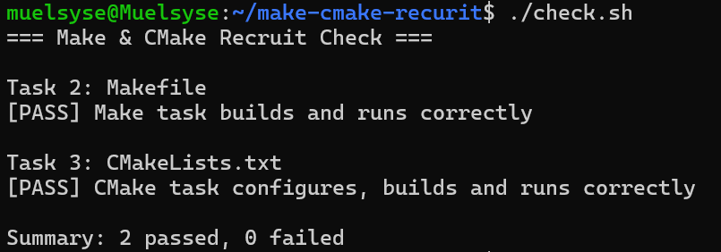

# Task 4：思考题

## 1. Make 和简单的 build.sh 有什么区别？

build.sh只是执行所有命令的脚本，而make通过makefile描述的文件间的依赖关系自动判断需要的构建步骤。在增量构建，即部分文件有变动时，仍然按照同样的依赖关系编译，且只重新编译发生变化的部分，既不用重复写指令，又节省了不必要的重复编译过程

## 2. CMake 是编译器吗？

执行 `cmake --build build` 时，最终是谁在编译 C 源文件？

不是，cmake简化了文件依赖关系的构建过程，本质上是自动生成了构建系统，通过构建系统调用gcc等编译器编译文件

## 3. 为什么不希望每次都重新编译所有 `.c` 文件？

部分文件修改并不会影响所有文件的编译，大部分可以沿用之前已经成功编译的文件。这样避免了重复编译，节省时间和资源

## Pass Image

